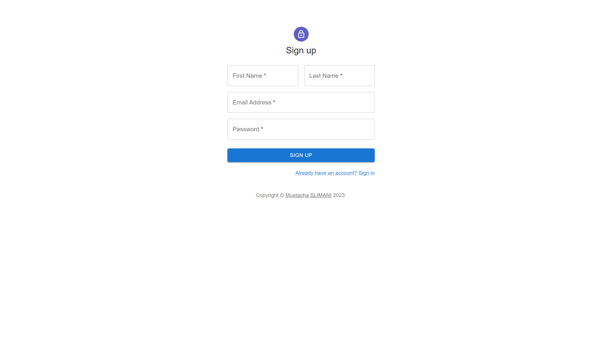
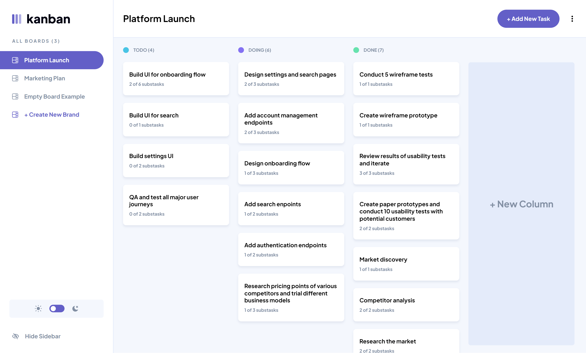

# 🚀 Kanban Task Management Application : Front-End Module


## Overview
This project comprises the frontend part of a Kanban Task Management Application developed using React. It offers an interface for efficient task management via a Kanban board layout which is responsive and works on all screen sizes. My goal was to explore the app Figma design and implement it using React Framework + Build a stable and scalable backend with Java Spring Boot.

**Explore the Back-End Module repository [here](https://github.com/Slimani-CE/kanban-back-end).**
#
              

## Project Structure
```
C:
├───package.json       => Project Dependencies
├───public             => Public Assets
├───README.md          => Project Description
├───src                => Project Source Code
    ├───api            => API Services (Handle Local Storage & Web API Calls)
    ├───assets         => Project Assets
    ├───components     => React Components
    ├───data           => Project Data (Mock Data)
    ├───dto            => Data Transfer Objects
    ├───hooks          => Custom React Hooks 
    ├───model          => Project Models
    └───svg            => SVG Icons
```

## Technologies & Dependencies

| Technology       | Use Case                   |
| ---------------- | -------------------------- |
| JavaScript       | Programming Language       |
| HTML             | Markup Language            |
| CSS              | Styling Language           |
| React            | Frontend Framework         |
| React Router DOM | Routing and Navigation     |
| Material UI      | Pre-built React Components |
| Font Awesome     | SVG Icons                  |
| Axios            | HTTP Requests              |

## Project Setup
1. Clone the repository to your local machine. **Note:** You need to have Git installed on your machine. If you don't have it, you can download it from [here](https://git-scm.com/downloads).
```bash
git clone https://github.com/Slimani-CE/kanban-front-end
```
2. Navigate to the project directory.
```bash
cd kanban-front-end
```
3. Install the project dependencies. **Note:** You need to have Node.js and npm installed on your machine. If you don't have them, you can download them from [here](https://nodejs.org/en/download/).
```bash
npm install
```
4. Run the project.
```bash
npm start
```
5. Open the project in your browser.
```bash
http://localhost:3000
```

## Project Screenshots
### Login Page


### Register Page


### Board Page


### Board Page : Explore A Task


## 🔮 Future Scope :
Future iterations of the application may include:

1. 🤝 Real-time Collaboration: Implementing features for real-time collaboration on tasks among multiple users.
2. 🌟 Enhanced User Experience: Continual refinement of the user interface and user experience based on user feedback.
3. 📊 Advanced Analytics: Introducing analytics and reporting features to track productivity and task progress.
## Author
- 2023 © [Mustapha SLIMANI](https://slimani-ce.github.io)
- LinkedIn: [Mustapha SLIMANI](https://www.linkedin.com/in/mustaphaslimani/)
- The app Figma design files were proposed by www.frontendmentor.io